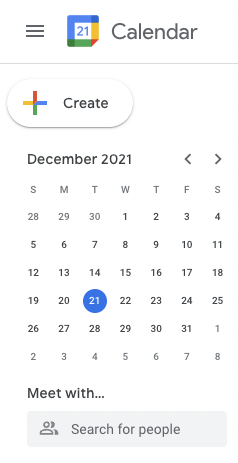
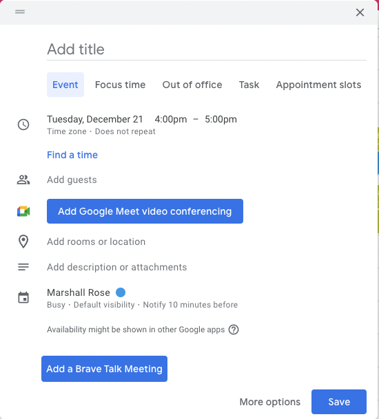
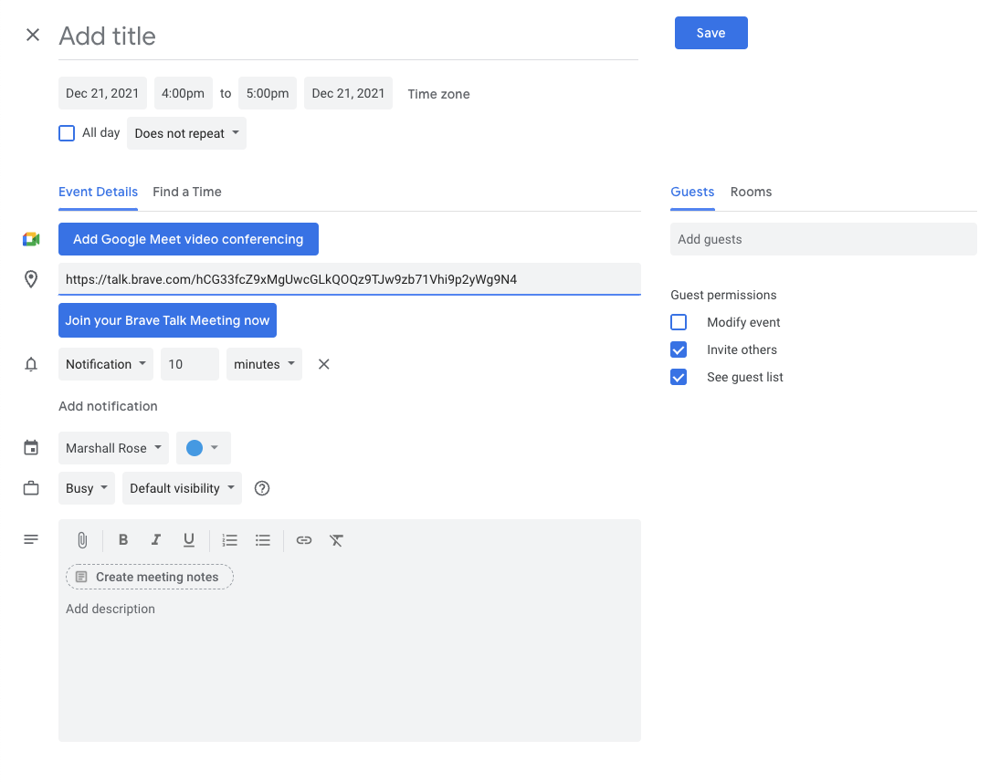
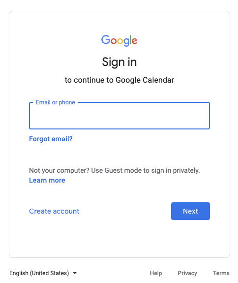

# Adding Cypress to test jidesha
[cypress](https://cypress.io) is a testing tool for "anything that runs in a browser".
It is a relatively "new" entry to the field
(in comparison to either [Selenium](https://github.com/SeleniumHQ/) or
[Puppeteer](https://github.com/puppeteer/puppeteer));
however,
it has several advantages in terms of using the same `runloop` as the JS in the browser,
allowing for synchronous (less buggy) execution of tests.

Our goal is to add testing for the extension.
The flow is simple:

When the user goes to [Google Calendar](https://calendar.google.com) and presses on the Create button:

they get a blank form:

If they click on "Add a Brave Talk Meeting",
then the extension makes a call to the Brave Talk website, invoking the "Create link" function
and the resulting URL is used to populate the location field in the detailed form:

# Basic Installation
Start with:

    % mkdir cypress
    % cd cypress
    % npm install cypress
    % npx cypress open

If you see this error

    ... node: --openssl-legacy-provider is not allowed in NODE_OPTIONS
    
Then close the `cypress` app and run this:

    % cp ../cypress.files/cypress.json .
    % npx cypress open

Now close the `cypress` app and install the remaining files.

    % cp ../cypress.files/cypress/plugins/index.js cypress/plugins/
    % cp ../cypress.files/cypress/integration/jidesha.js cypress/integration/
    % npx cypress open

# What we want to test

0. In the `cypress` app, select "Brave 96" from the upper-right corner

1. Go to the [extensions tab](brave://extensions/), remove "Brave Talk Meetings" if present,
then "Load unpacked" from the `dist/` directory

2. Login to calendar.google.com

3. Press the "Create" button

4. Press the "Add a Brave Talk Meeting" button

5. Verify that the Location field has a URL that looks like a Brave Talk URL

6. Open the Location field and verify that moderator privileges are present
(enter the room, click on the "More actions" ellipsis and see if "Start recording" — an action reserved for moderators —
is present)

# Is this suitable for automated testing?
Search for "Only Test Apps You Control" on [this link](https://docs.cypress.io/guides/getting-started/writing-your-first-test)
and you'll see a rather concerning warning "You *shouldn't* test applications you *don't control.* The warning explains why:

- They are liable to change at any moment which will break tests.

- They may do A/B testing which makes it impossible to get consistent results.

- They may detect you are a script and block your access (Google does this).

- They may have security features enabled which prevent Cypress from working.

So the question is whether we consider the extension an application we control,
or only part of an application that is controlled by someone else
(i.e., Google that is specifically called out in the warning).

It appears that the answer is the latter,
and that automated testing is going to be problematic.

Let's start with Step 1 above:

If we inspect the "Email or phone" `<input/>` element, we get:

    <input type="email"
        class="whsOnd zHQkBf"
        jsname="YPqjbf"
        autocomplete="username"
        spellcheck="false"
        tabindex="0"
        aria-label="Email or phone"
        name="identifier"
        autocapitalize="none"
        id="identifierId"
        dir="ltr"
        data-initial-dir="ltr"
        data-initial-value=""
    >

which thankfully has both `name` and `id` attributes, and so can be scripted with

    cy.visit('https://calendar.google.com')
    cy.get('input[name="identifier"]').type(${username})

Now what about the "Next" `<button/>` element:

    <button class="VfPpkd-LgbsSe VfPpkd-LgbsSe-OWXEXe-k8QpJ VfPpkd-LgbsSe-OWXEXe-dgl2Hf nCP5yc AjY5Oe DuMIQc qIypjc TrZEUc lw1w4b"
        jscontroller="soHxf"
        jsaction="click:cOuCgd; mousedown:UX7yZ; mouseup:lbsD7e; mouseenter:tfO1Yc; mouseleave:JywGue; touchstart:p6p2H; touchmove:FwuNnf; touchend:yfqBxc; touchcancel:JMtRjd; focus:AHmuwe; blur:O22p3e; contextmenu:mg9Pef;"
        data-idom-class="nCP5yc AjY5Oe DuMIQc qIypjc TrZEUc lw1w4b"
        jsname="LgbsSe"
        type="button"
        style="--mdc-ripple-fg-size:47px; --mdc-ripple-fg-scale:2.06324; --mdc-ripple-fg-translate-start:12.1719px, -4.48438px; --mdc-ripple-fg-translate-end:16.0859px, -5.5px;"
        >
        

        Next
    </button>

Note the lack of either a `name` or `id` attribute, and how the `class`, `jsname`, and `jsaction` attribute values are
auto-jibberish.
Accordingly, the parameter to the `cy.get` call to identify the `<button/> element is likely going to require editing each time
the release repository is updated.
(Note that searching the various Github repo for solutions yields
[this plugin](https://github.com/lirantal/cypress-social-logins) which is for "Google Social Logins" using OAuth2,
which isn't what we want.)

Finally,
note that moving the tests to either `Selenium` or `Puppeteer` will likely be just as difficult.

Of course, one could start the test manually, by opening a browser and performing Steps 1 and 2 from the
[scenario](#what-we-want-to-test) above.
At that point,
however,
it is probably less error-prone and more timely to simply do Steps 3-6 by hand.
Accordingly, it maybe best to simply have `npm test` simply bring up a tab with that scenario so that the steps can be done
manually.
